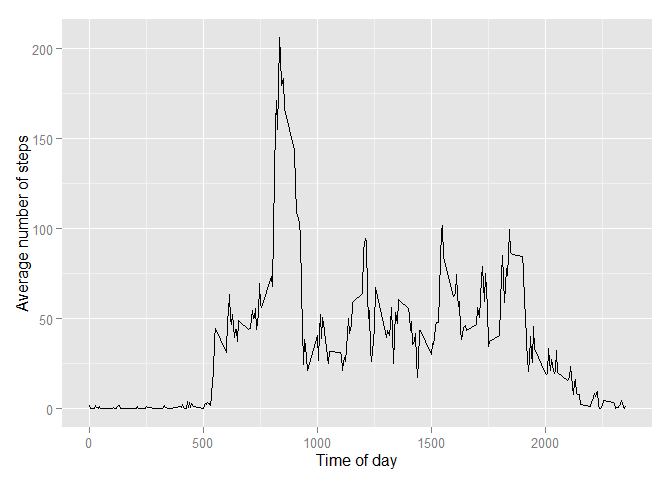

# Reproducible Research: Peer Assessment 1


## Loading and preprocessing the data
Prior to answering the questions we will download the dataset and load it.


```r
library('ggplot2')
options(scipen = 1)

if(!file.exists("getdata-projectfiles-UCI HAR Dataset.zip")) {
        temp <- tempfile()
        download.file("http://d396qusza40orc.cloudfront.net/repdata%2Fdata%2Factivity.zip",temp)
        unzip(temp)
        unlink(temp)
}

dataset <- read.csv("activity.csv")
```


## What is mean total number of steps taken per day?

First of all we will narrow down the dataset to use only complete cases.
The dataset will be aggregated then, plus values for median and mean will be calculated.


```r
complete_dataset = dataset[complete.cases(dataset),]
aggdata <-aggregate(complete_dataset$steps, by=list(complete_dataset$date), FUN=sum)
agg_mean <- mean(aggdata$x)
agg_median <- median(aggdata$x)
ggplot(aggdata, aes(x=x)) + geom_histogram( colour="black", fill="white")
```

```
## stat_bin: binwidth defaulted to range/30. Use 'binwidth = x' to adjust this.
```

 

Mean total value of steps is equal **10766.1886792** while median is equal **10765**.


## What is the average daily activity pattern?
From the calculation made aboe we can easily create a histogram showing us the avarage daily pattern.


```r
mean_tod <- aggregate(complete_dataset$steps, by=list(complete_dataset$interval),mean)

ggplot(mean_tod, aes(Group.1, x)) + geom_line() + xlab("Time of day") + 
    ylab("Average number of steps") 
```

 

```r
rush_hour = mean_tod[which.max(mean_tod[,2]),1]
```

The time with the biggest number of steps is 835 interval.

## Imputing missing values

The existing NA values will be replaced by the mean value for the corresponding time interval across all the days.


```r
na_dataset = dataset[is.na(dataset[,1]),]
na_rows = nrow(na_dataset)
imputed_dataset = lapply(na_dataset[,3] ,   function(x) { mean_tod[which(mean_tod[,1] == x) , 2  ]  } ) 
imputed_dataset <- unlist(imputed_dataset)
na_dataset[,1] =  imputed_dataset


fixed_dataset = rbind( complete_dataset , na_dataset)
fixed_aggdata <-aggregate(fixed_dataset$steps, by=list(fixed_dataset$date), FUN=sum)
ggplot(fixed_aggdata, aes(x=x)) + geom_histogram( colour="black", fill="white")
```

```
## stat_bin: binwidth defaulted to range/30. Use 'binwidth = x' to adjust this.
```

 

```r
fixed_na  <- cbind(fixed_aggdata , 'na fixed')
not_fixed_na  <- cbind(aggdata , 'without na')
names(fixed_na)= c('day', 'steps' , 'na_status') 
names(not_fixed_na) = names(fixed_na)
both_sets <- rbind(not_fixed_na  , fixed_na)
ggplot(both_sets, aes(x=steps, fill=na_status)) + geom_histogram( alpha=.5, position="identity")
```

```
## stat_bin: binwidth defaulted to range/30. Use 'binwidth = x' to adjust this.
```

 

```r
fixed_mean = mean(fixed_aggdata[,2])
fixed_median =  median(fixed_aggdata[,2])

fixed_steps_sum = sum(both_sets[,2])
```

There are **2304** missing values.
Missing values were replaced and the dataset *both_sets* was created.
Main difference is seen only during peek hours. The total number of steps changed the value of median 10766.1886792 but left 10766.1886792 unchanged. Total number of steps for all days changed to 1.2273455\times 10^{6}.


## Are there differences in activity patterns between weekdays and weekends?

Code below  tags each row based on the week day. If it is not weekend row is tagged as 'weekday' otherwise 'weekend'. Later on it is used to create a graph with two separate histograms.


```r
Sys.setlocale("LC_TIME", "English")
```

```
## [1] "English_United States.1252"
```

```r
wdmap <- weekdays(as.Date(fixed_dataset[,2]) , abbr = TRUE) %in% c('Sat', 'Sun')
week_column = unlist(lapply(wdmap ,   function(x) { if (x) 'weekend' else 'weekday'  } ) )
week_dataset= cbind( fixed_dataset , as.factor(week_column) )
names(week_dataset)[4] = 'week'
mean_week_tod <- aggregate(week_dataset$steps, by=list(week_dataset$interval, week_dataset$week ),mean)
names(mean_week_tod) = c('interval', 'week' , ' steps')
df = data.frame(mean_week_tod)
ggplot(data=df, aes(x=interval, y=X.steps, group=week, colour=week)) + geom_line() + geom_point()
```

 

We can see that during the weekday there is a peek between 9 and 10 o'clock and activity starts around 5 o'clock. During weekends it shifts toward later hours, but is at higher level up to evening hours. Then, again we can see a peek around 8 pm in weekends, that is not present during weekdays.
